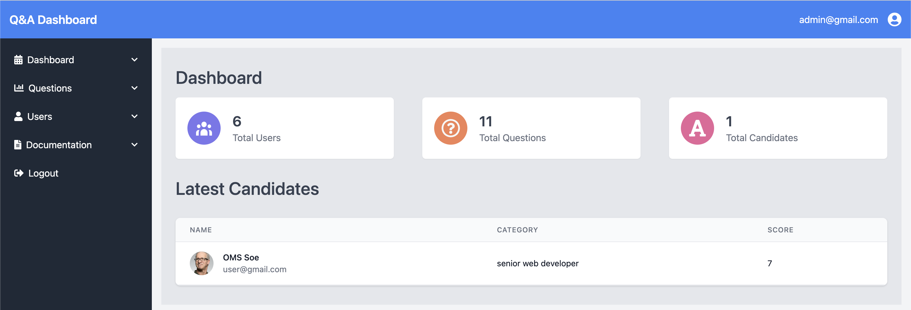

# Quiz App Project Description

This project is to build a quiz app using the MERN stack, which consists of MongoDB, Express.js, React.js, and Node.js. The app will allow users to create accounts, take quizzes on a variety of topics, and track their progress. Inspired from linkedinskillasseessment.

# Web URL
https://quiz-app-react-23.netlify.app/

# Backend

The backend of the app will be built using Node.js and Express.js. It will expose a REST API that the frontend can use to interact with the database. The backend will also be responsible for handling user authentication and authorization.

# Features

# Client View

The quiz app will include the following features:

- User Account: Users can create accounts to track their progress and compete with others.
- Socail Login: User can easily create accounts with Socail Login (Google, Github)
- User Account Setting: Users can create new password and change informaition.
- Quiz selection: Users can browse and select quizzes from a variety of topics.
- Quiz timer: Some quizzes may include a timer to challenge users to complete the quiz in a certain amount of time.
- Scoring and feedback: The app will provide users with their score and feedback on their answers.

# Admin View Panel

- Dashboard: Dashboard will show total users, total questions, total canditates and latest canditates information.
- Quiz lists: Administartor can browse all of quizzes and then administrator can CREATE, READ, UPDATE and DELETE of quiz.
- Categores: Administartor can browse all of categories and then can CREATE, READ, UPDATE and DELETE of categories.
- Users: Administartor can see all of users informations.
- Filter: Can filter quiz with cateogory and level

# Functionality

- Socail Login (GitHub, Google)
- Authenication and Authorization with JWT Web Token
- State management with React Context API
- Fetching API with React Custom hook (CommonApi)
- Login and Signin fetch with React Custom hooks ( Login, Signup)
- Edit User Information
- Protected Routes

# Tech Used

## Frontend

- React
- React Router V6
- React-hook-form
- Typescript
- Axios
- Tailwind CSS

## Backend

- Node.js
- Express.js
- MONGODB
- JWT Token
- BCRYPTJS

Icons - Fonts Awesome

# How to Run Local Environment

### Run Backend Server

```
$ cd backend
$ yarn start
```



### Run Frontend

```
$ cd quiz-app
$ yarn start
```


